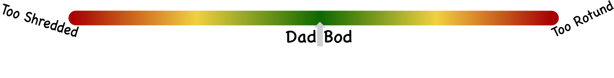
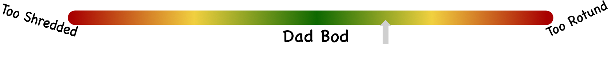
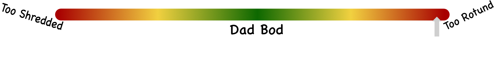
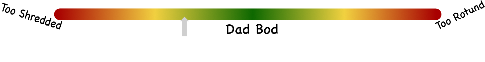
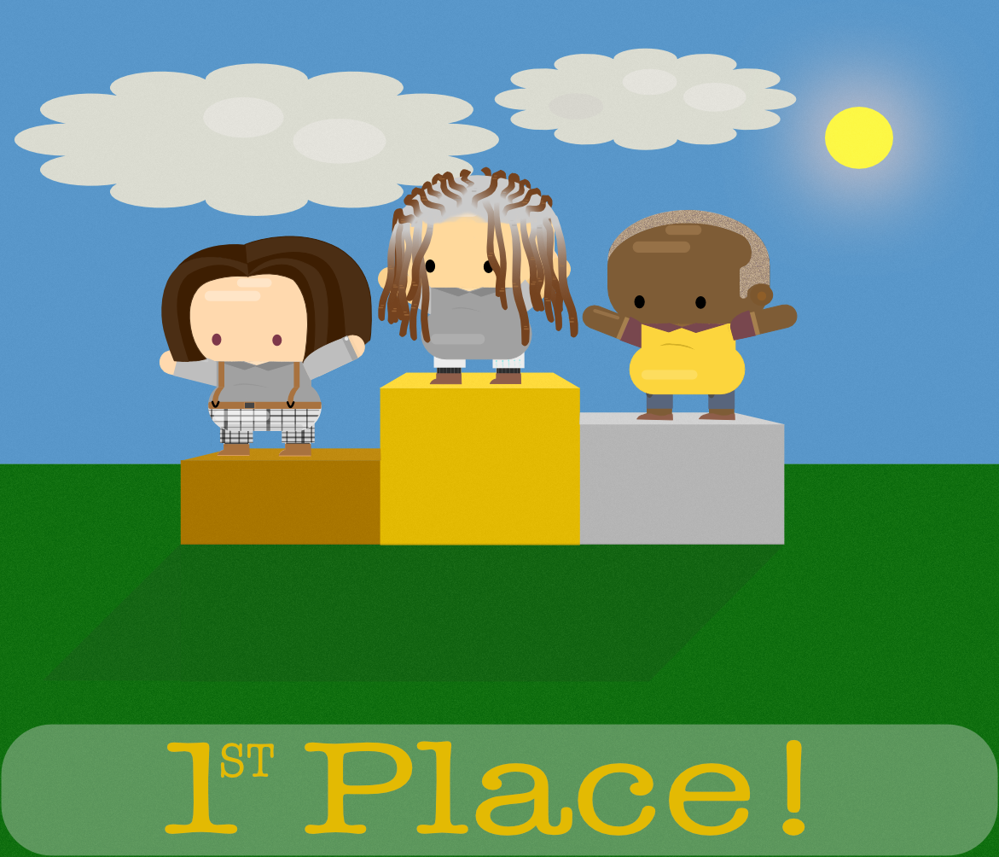

# DadBod Gameplay
DadBod is a game in which you take care of your Bod. If you don't take care of him he will go out of control and either become insanely obese, or frighteningly ripped.

Obviously, we don't want either of these to occur to our Bod, so we must remain vigilant.

## Designing Your Bod
Those who don't get in on the initial DadBod mint can still access the game by purchasing a Bod.  
People who join in this way can design their Bod in any way they want: Choose their haircolor and style, facial hair style, skin color, etc.  
Fresh Bods will have generic items, but players can go deck out their Bod at the shop described in [Items](Items.md).  
To keep Bods separate from DadBods, and because we believe in segregation of the elite, Bods will not have the golden ear mentioned in [DadBodNFT](DadBodNFT.md).  

## The Dailies
Take care of your Bod consistently to make sure you don't lose that prime shape.  
You don't want a GodBod. Save that for the afterlife.  
You don't want a PotatoBod. Gotta keep up with the wifey.  
You want.. you **need** the DadBod.  

Every day you will drift further from the perfect bod.  
This must be prevented.  
Login daily to keep your bod on track.  

### Details
This is the DadBod Conditioning Bar, or the DadBod Bar:

Your Bod will drift towards the end it is closest to.  
For example, let's say your bod is here on the DadBod Bar:

and you leave your Bod alone for too long, he will end up with the PotatoBod, which looks like this:

Likewise, if you are slightly too shredded and your DadBod Bar is here:

your Bod will end up working out far too much.  
  
As we can see, Bods appear to polarize their health. We aren't sure why. Haven't figured that out yet.  
  
Your mission, should you choose to accept it, is to prevent both the GodBod and the PotatoBod.
Log in each day and rip those potato chips out of his hands, if he's too fat. Get him off the treadmill if he's too godlike. Keep the dad bod.

## The Minigames

You can play minigames whenever you want.  
Your ability to play each minigame will be a function of how close to the center of the DadBod Bar you are. The closer to the perfect bod, the better your Bod will perform.  

Minigames will be anything from racing to the hotdog stand, rolling down a hill, cooking for the company, and fighting through the grocery store to get what your wife asked you to find. Be ready for anything.  

### Unranked
Unranked game modes will not give you any crypto in return. They are meant for practice and fun between friends.  

### Ranked
Ranked game modes will give crypto to the winners. This mode will pit players against eachother. May the best bod win.  
